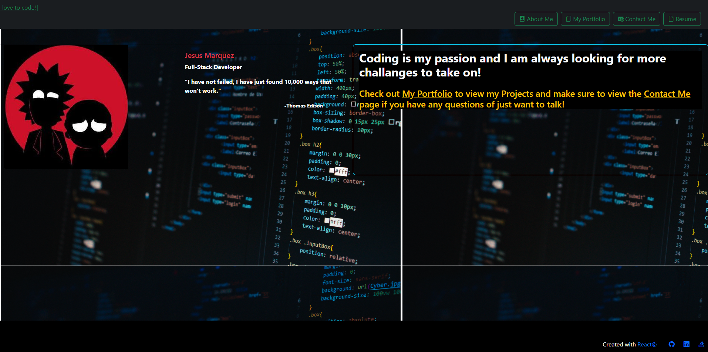

 # React-Portfolio
  [

  ## [Description](table-of-conents)

  This is a Portfolio website built with React that displays a few of  projects that I have worked on.

  ## Table of Contents 

  * [Installation](#installation)
  * [Usage](#usage)
  * [Credits](#credits)
  * [License](#license)
  * [Contribute](#contribute)

  ## [Installation](#table-of-contents)

  this project does not need to be installed.

  ## [Usage](#table-of-contents)

  1. Navigate to the URL of the live site, 
  2. Browse my portfolio.
[Visit the live- site !](https://jay-mm.github.io/perfil-reaact/)

  
  ## [Credits](#table-of-contents)
  
  this app uses the folowing technologies:
  -  React 
  - Typewriter Node Package  
  - bootstrap 
  
  ## [License](#table-of-contents)
  
   
    This project is licensed by mit.
    [mit](https://choosealicense.com/licenses/mit)
  
      
  
  ## [Contribute](#table-of-contents)
  
  if you would like to contribute to this project or have any pointers  feel free to contact me.
  
  ## [Questions](#table-of-contents)

Contact me through [e-mail](mailto:marquez.jay444@gmail.com)

Connect with me through [GitHub.](https://www.github.com/Jay-MM)